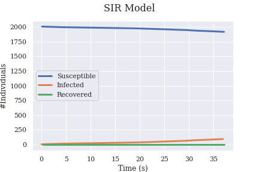

# Pandemic Simulation
Prework for [Pandemic Simulation with Reinforcement Learning](https://github.com/Hsgngr/Pandemic_Simulation)
This project is for simulating a Pandemic and analyzing the data with Unity

The step-by-step tutorials for this project is on [Medium/@hosgungor](https://medium.com/@hosgungor)

## Screenshots from the simulation:
Simulating how infection spreads

Analyzing SIR Graphs

## Authors

* **Ege Hosgungor** - *Initial work* - [Hsgngr](https://github.com/Hsgngr)

## Acknowledgments

### Inspiration
This project is inspired from followings:
#### Coronavirus Related
* [Corona Simulator](https://www.washingtonpost.com/graphics/2020/world/corona-simulator/)
* [Simulating an epidemic](https://www.youtube.com/watch?v=gxAaO2rsdIs)

#### Unity Ml Agents Related
* [Unity ML Agents Penguins Tutorial](https://connect.unity.com/p/ml-agents-penguins-unity-learn)
* [Unity ML Agents Hummingbirds Tutorial](https://learn.unity.com/course/ml-agents-hummingbirds?uv=2019.3)

#### Reinforcement Learning Related
* [Emergent Tool Use From Multi-Agent Autocurricula](https://arxiv.org/abs/1909.07528)
